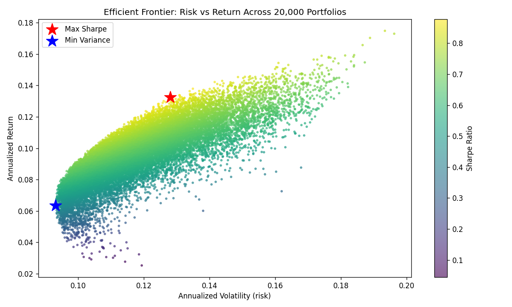

# Portfolio Risk, Return & the Limits of Diversification

A self-contained Python analysis of a multi-asset portfolio: measuring risk and return properly, quantifying how much diversification actually helps, and mapping the efficient frontier via Monte Carlo simulation.

The point of this project is not to recommend a portfolio. It is to demonstrate a way of working: take a markets question, measure it with the right metrics, and interpret the result honestly — including stating what the analysis *cannot* tell you.



## What it does

- Pulls real daily price data for a deliberately diverse set of assets (US large-cap, US tech, long-term treasuries, gold, developed international equity)
- Computes annualized **return, volatility, and Sharpe ratio** for each asset
- Builds a **correlation matrix** and reasons about how much diversification is actually available
- Runs a **20,000-portfolio Monte Carlo** simulation to approximate the efficient frontier
- Identifies the **maximum-Sharpe** and **minimum-variance** portfolios and their weights
- Plots the frontier, coloured by Sharpe ratio

## Why these choices

- **A diverse asset set** — the mix deliberately includes assets that should *not* all move together (equities vs. treasuries vs. gold), so diversification has something to work with.
- **Transparent metrics, not a black box** — annualization, Sharpe, and a covariance-based portfolio volatility, kept explicit in the code rather than hidden inside a library optimizer.
- **Monte Carlo instead of a solver** — randomly sampling long-only weights keeps the logic auditable and easy to follow, at the cost of not pinpointing the exact analytical frontier (a deliberate readability trade-off).

## Key takeaways (and honest limits)

**What the analysis supports**
- Combining low/negatively-correlated assets produces portfolios with better risk-adjusted return than most single assets — diversification is real and measurable here.
- The minimum-variance and maximum-Sharpe portfolios are *different* points: lowest risk is not the same as best risk-adjusted return. The right choice depends on the investor's objective, not the maths alone.

**What it does *not* support**
- The optimal weights are **backward-looking** — they optimize the past. Correlations and returns shift, so this is not a recommendation to hold these exact weights.
- Sharpe assumes well-behaved returns; it **understates tail risk**, and correlations tend to rise in crises — exactly when diversification is needed most. The historical frontier flatters diversification relative to a real crash.
- A fixed risk-free rate and a 10-year window are simplifying choices that affect the numbers. They are stated, not hidden.

## Running it

```bash
pip install -r requirements.txt
python portfolio_analysis.py
```

The script prints the metrics, correlation matrix, and optimal-portfolio weights to the console, and saves `efficient_frontier.png`. Data is pulled live from Yahoo Finance via `yfinance`, so exact figures vary with the run date — the method and reasoning are the point, not any single number.

## Tech

Python · pandas · NumPy · matplotlib · yfinance

## About

Built by **Amit Kumar** as part of a portfolio exploring the intersection of data analytics and financial markets.
Portfolio: [amitkumaranalytics.com](https://amitkumaranalytics.com) · LinkedIn: [linkedin.com/in/amit1820](https://linkedin.com/in/amit1820)

*This project is for demonstration and educational purposes only. It is not investment advice.*
