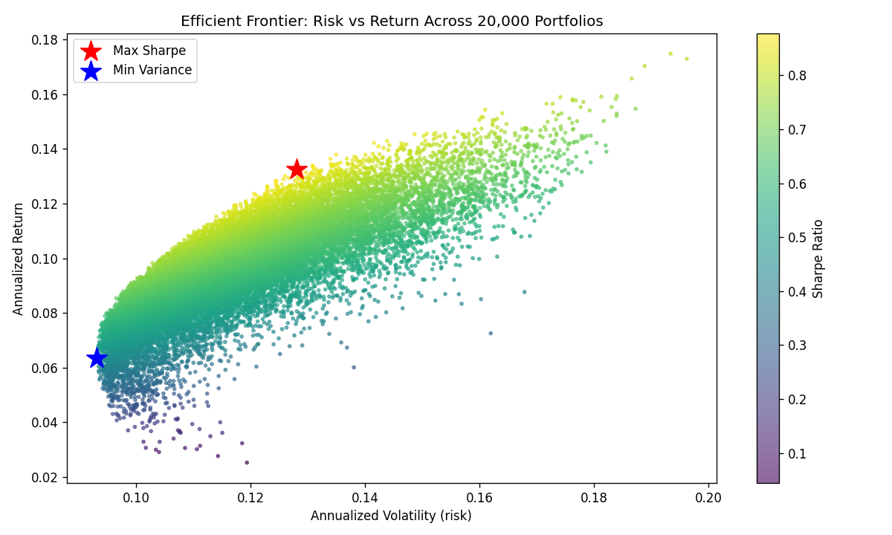

# Portfolio Risk, Return and Diversification

How do different asset weights change a portfolio's historical risk and return?

This Python project measures five ETFs, examines their correlations and samples **20,000 long-only portfolios**. It identifies the highest-Sharpe and lowest-volatility portfolios **among those samples**.

[Portfolio case study](https://amitkumaranalytics.com/projects/portfolio-risk-return-diversification) · [About Amit](https://amitkumaranalytics.com)



*Saved example output. Re-running the script replaces this image; results depend on the downloaded data and environment.*

## The analytical question

Holding several assets does not by itself show how much diversification is achieved. This project makes the relationship between weights, covariance, return and volatility explicit, so the result can be inspected and challenged.

## Configuration in the code

| Setting | Value |
|---|---|
| Assets | SPY, QQQ, TLT, GLD and EFA |
| Requested dates | Start 2015-01-01; end 2024-12-31 |
| Annualisation | 252 trading days |
| Risk-free-rate assumption | 2% annually |
| Portfolio samples | 20,000 |
| Random seed | 42 |
| Weight constraints | Non-negative; sum to one |

The dates are fixed in `portfolio_analysis.py`; this is not a rolling ten-year window.

## How it works

1. Download prices through `yfinance` and remove dates with missing prices.
2. Calculate daily simple percentage returns.
3. Annualise the arithmetic mean return and sample volatility.
4. Calculate pairwise return correlations.
5. Generate random positive weights and normalise each vector to sum to one.
6. Calculate each sampled portfolio's return, covariance-based volatility and Sharpe ratio.
7. Print asset statistics, correlations and selected weights; save the risk–return plot.

Portfolio volatility incorporates the covariance matrix: it is not simply the weighted average of individual asset volatilities.

## Run locally

```bash
git clone https://github.com/amit1820/data-driven-portfolio-analysis.git
cd data-driven-portfolio-analysis
python -m venv .venv
```

Activate the environment:

- Windows PowerShell: `.venv\Scripts\Activate.ps1`
- macOS/Linux: `source .venv/bin/activate`

Then:

```bash
python -m pip install -r requirements.txt
python portfolio_analysis.py
```

Internet access is needed for the price download. The terminal prints the metrics and weights; `efficient_frontier.png` is written to the working directory.

## How to interpret the output

Compare the lowest-volatility sample with the highest-Sharpe sample: they optimise different objectives. Inspect the correlations and weights before interpreting the plot.

The scatter shows sampled feasible portfolios. Its upper boundary approximates the historical efficient frontier; the script does not solve for an exact frontier or guarantee the globally optimal weights.

## Assumptions and limitations

- Annual return is an annualised arithmetic mean, not compound annual growth.
- Historical estimates do not predict future returns, correlations or allocations.
- Sharpe summarises excess return relative to volatility; it does not describe drawdowns or tail losses.
- The 2% risk-free rate is a fixed assumption rather than a dated interest-rate series.
- Transaction costs, taxes, turnover and out-of-sample validation are not modelled.
- The downloader selects `Close` without explicitly setting `auto_adjust`. Adjustment behaviour depends on the installed yfinance version and should be made explicit before relying on the estimates.
- Dependency versions and the downloaded dataset are not locked. A fixed seed alone does not make the entire run reproducible.
- Interpret the calculations and saved output; the script's concluding prose is static and does not test every assertion it prints.

## Repository

- `portfolio_analysis.py`: data download, metrics, sampling and plot.
- `requirements.txt`: Python dependencies.
- `efficient_frontier.png`: saved example output.
- `LICENSE`: project licence.

Educational analysis, not an investment recommendation.
